# 03_20 report

## 實驗設定

| 項目 | 內容 |
|------|------|
| 資料集 | 7,813 首台灣流行歌曲（1973–2021） |
| 時期劃分 | 1975–1993 / 1993–2005 / 2006–2022 |
| Embedding 模型 | MERT-v1-330M（m-a-p/MERT-v1-330M） |
| 音訊擷取方式 | 每首歌中間 30 秒，單聲道，24kHz |
| Embedding 維度 | 1024-dim（last hidden state mean pooling） |
| Probe 模型 | MLP（1024 → 512 → 58），訓練於 MGPHot 資料集 |
| Probe 訓練資料 | MGPHot 21,299 首美國歌曲，58 個音樂屬性分數（gene_values） |
| Probe RMSE | 0.1649 |
| 特徵數量 | 58 個音樂屬性（人聲、和聲、節奏、樂器、歌詞、製作等） |
| 比較基準 | MGPHot 美國音樂 gene_values（ground truth） |

---

[專輯曲目年代分佈](#專輯曲目年代分佈)

## 分析結果

  2. 台灣 vs 美國差距最大的地方
  - 台灣 > 美國：Compound Meter (+0.073)、Triple Meter（拍子更複雜）
  - 美國 >> 台灣：Vocal Register (-0.57)、Minor/Major Key (-0.52)、Backbeat (-0.49)、Danceability (-0.47) →
  美國節奏感、舞曲性遠高於台灣

  7. 分群問題
  所有 cluster 的 top features 都一樣（Focus on Lead Vocal + Lyrics），台灣流行樂太集中，用 58
  特徵的原始空間分群效果差。需要先降維或選特定特徵子集再分群。

### 1. 台灣音樂整體特徵輪廓
1. 台灣音樂特徵輪廓
  - 最突出：Focus on Lead Vocal (0.53)、Focus on Lyrics (0.43)、Acoustic Sonority → 以人聲為核心的抒情樂
  - 最低：Synthesizer、Angry/Social Lyrics、Horn Ensemble

    > 歌詞分析結果受限於預訓練模型的西方文化背景，在處理中文語境或台灣特有的抒情敘事風格時，可能存在特徵識別上的落差，僅供相對趨勢參考。

    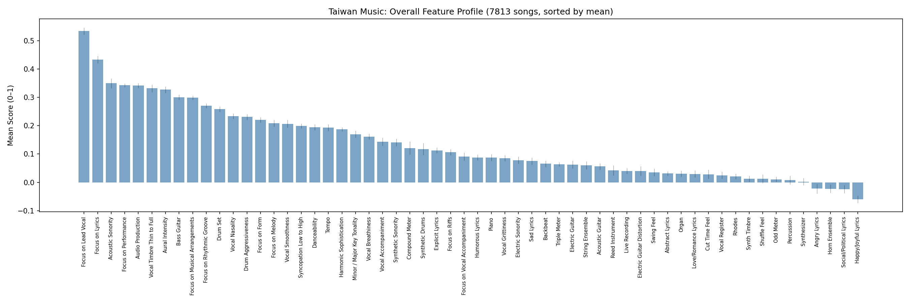
    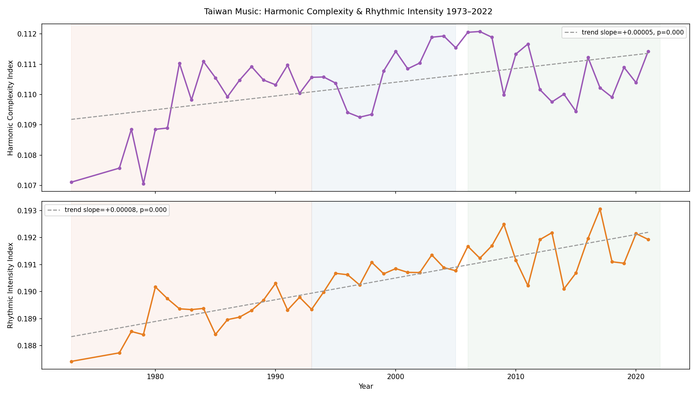

---

### 2. 逐年趨勢（上升 & 下降特徵）

- 上升趨勢（電子化、現代化）：Synthetic Drums、Synthetic Sonority、Danceability、Vocal Accompaniment、Synth Timbre。    
都在 1975–2022 間穩定上升，反映台灣音樂逐漸電子化的製作走向。
- 下降趨勢（有機感、情緒性）：Vocal Timbre Thin to Full、Vocal Smoothness、Sad Lyrics、Vocal Grittiness、Acoustic Sonority、Live Recording。   

    > 量化呈現了台灣流行音樂從類比錄音轉向數位修飾的過程。早期作品中明顯的人聲砂礫感與音色波動，反映了早期錄音設備特有的雜訊與較少的人工干預；而現代趨勢則顯示人聲處理變得更加標準化與純淨。也反應了早期那種濃厚的悲情色彩逐漸下降，轉向更現代、中性的聲音。

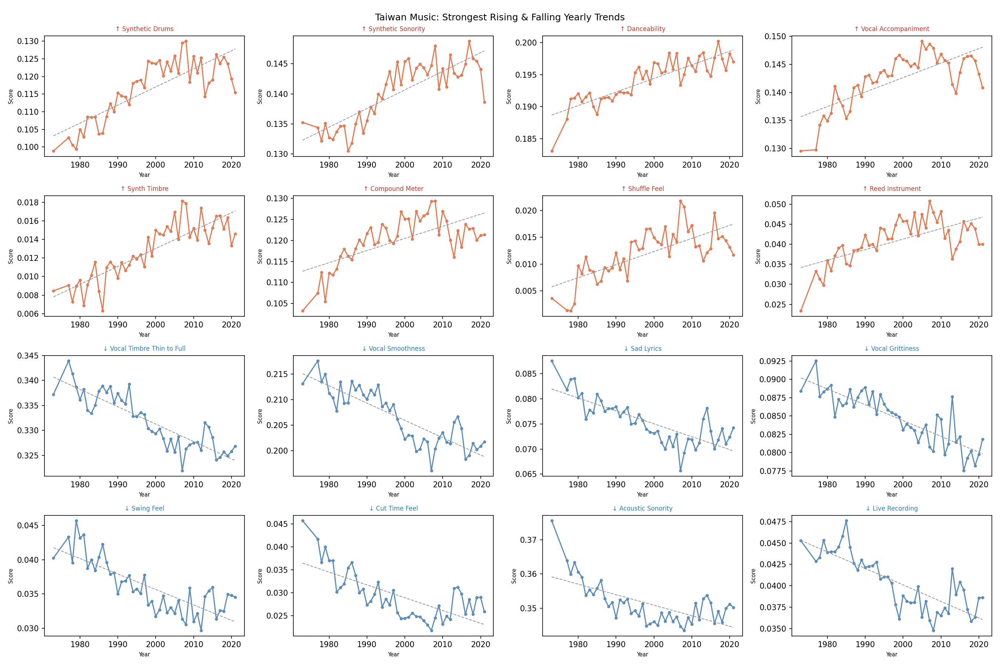

---

### 3. Foote Novelty — 革命年份

數據顯示 1982 與 2011 前後是台灣音樂的兩大變革期，但必須考慮樣本數量的局限：

- 1970年代資料庫只有13張，對應1980-1984的55張，讓年代初期的變動被過度放大，形成一個極高的峰值。 [專輯年代分布參考](#專輯曲目年代分佈)

- 後期低估： 2006 年之後的收錄專輯數量降低（每年約 10 張），在樣本不足的情況下，模型計算出的創新程度（Novelty）可能會低於真實變化。

1987–1988 和 1994–1995 這兩個 Tier 2 峰值

這段時間樣本量是全資料集最大的（每年 150–320 首），峰值比較可信

- 1987–1988：可能對應台灣解嚴（1987）帶來的音樂多元化
- 1993–1994：明顯是低點 那段時間風格最穩定、最同質，可能對應國語流行音樂商業模式成熟定型的時期
- 1997–1998：千禧年前夕

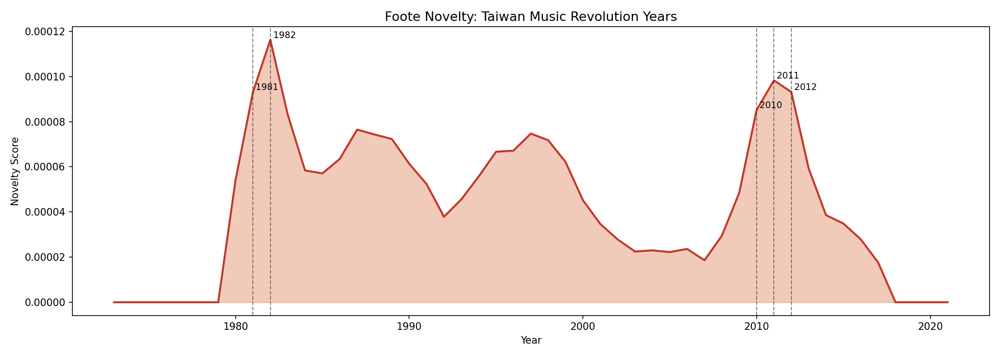

---

### 4.年代性比較（1975–1989 vs 2000–2022）

**分組設定**
- Group A（類比時代）：1975–1989，n = 1,581 首
- Group B（數位時代）：2000–2022，n = 3,168 首
- 1990–1999 作為緩衝區排除

預期差異： 原假設早期類比錄音與民歌風格，會使 MERT Embedding 提取產生不同於現代數位音訊的特徵分佈。
然而實驗結果顯示兩個時期的 gene_values 分布幾乎一致，年代性偏差並不顯著。

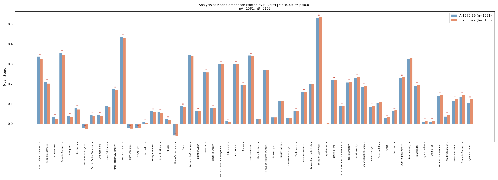
圖1（mean comparison）： 兩組均值差距極小，幾乎所有 feature 的藍橘 bar 長度幾乎一樣。
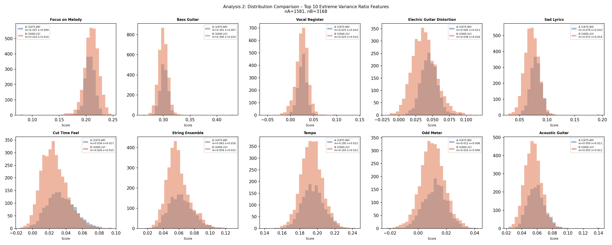
圖2（histogram）： 十個 variance 差異最大的 feature，兩組分布形狀幾乎完全重疊。
   > 圖 2 顯示差異最極端的 10 個特徵的分布比較。兩組的分布形狀高度相似，現代音樂的分布略寬（std 0.014 vs 0.009），可能反映現代台灣音樂風格較為多元。

現象定性： 預測分佈的「年代性不敏感」並非代表 Probe 表現穩健。結合 UMAP 分析顯示，台灣音樂整體與美國基準空間完全分離。

### 5. TW vs MGPHot Embedding 空間比較

<table style="width: 100%; border: none;">
  <tr style="border: none;">
    <td style="width: 50%; border: none;">
      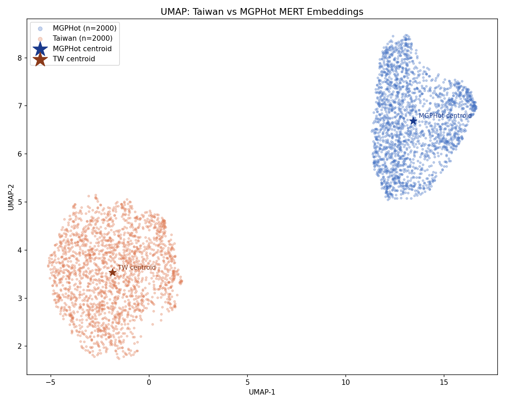
      
圖 1：UMAP 分布

    </td>
    <td style="width: 50%; border: none;">      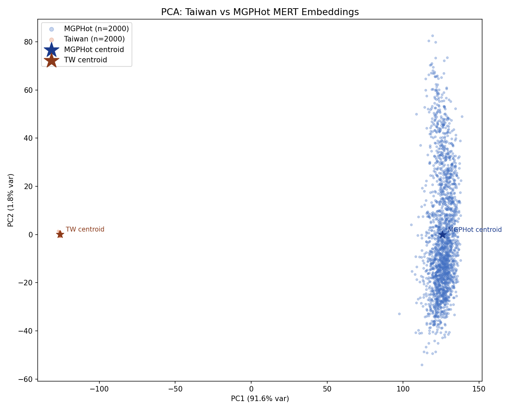
      
圖 2：PCA 分布

    </td>
  </tr>
</table>

顯著的空間偏離 (Spatial Divergence)：
兩群體在 UMAP 與 PCA 平面上幾乎無重疊。PCA 的 PC1 解釋量高達 91.6%，暗示此分離源於高維空間的結構性差異，而非降維失真。

潛在的表示偏誤 (Potential Representation Bias)：
數據反映 MERT 對台美音樂產生了截然不同的內部表示。這代表以西方語料訓練的 Probe 在處理台灣音樂時，可能面臨 Out-of-Distribution (OOD) 挑戰，導致預測基準的適用性受限。

維度解析度的不對稱性：

PC1 (91.6%)： 主要捕捉跨文化的宏觀差異，反映兩者在底層特徵（如人聲權重或能量分布）存在明顯斷層。

PC2 (1.8%)： 能區分美國歌曲的多樣性，但台灣歌曲在此維度分布緊湊，顯示模型對非西方語料的特徵區辨精度 (Discriminative Precision) 較低。

### 6.台美音樂特徵差異與歷年相似度走勢

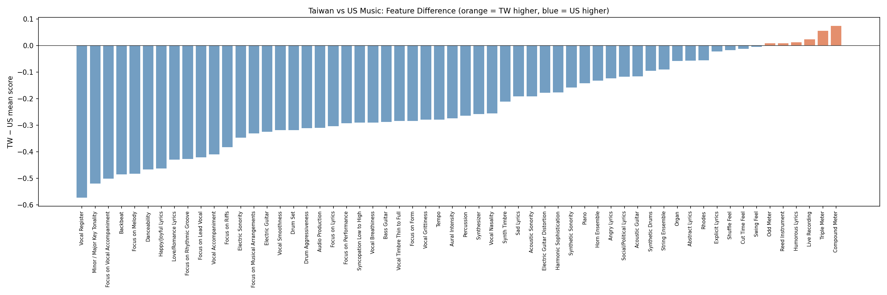
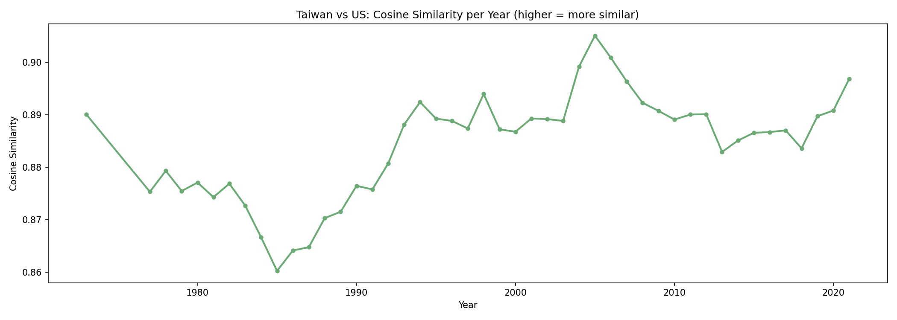

所有特徵分析均基於 Western probe 的輸出，UMAP 與 PCA 分析已證實台灣音樂在 MERT embedding 空間存在 distribution shift。因此，特徵分數的絕對值應謹慎解讀，但跨年代的相對趨勢方向仍具參考價值。

---
#### （分群）

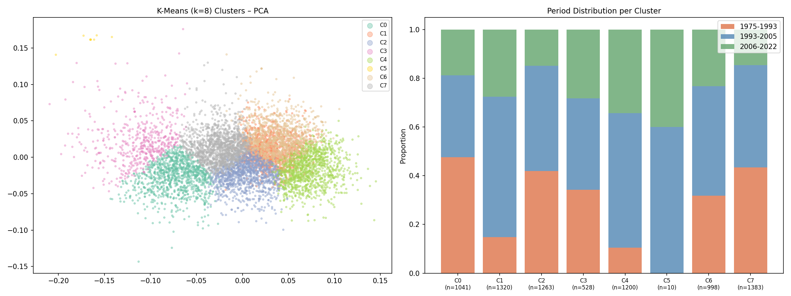

#### 專輯曲目年代分佈

|   年份 |    歌曲 |    專輯|
|--|---|---|
|       1973 |    12  |    1|
|       1977 |    12  |    1|
|       1978 |    56  |    5|
|       1979 |    67  |    6|
|       1980 |   120  |   11|
|       1981 |   175  |   16|
|       1982 |    87  |    8|
|       1983 |    95  |    9|
|       1984 |   114  |   11|
|       1985 |   164  |   16|
|       1986 |   152  |   14|
|       1987 |   186  |   17|
|       1988 |   144  |   13|
|       1989 |   209  |   21|
|       1990 |   156  |   15|
|       1991 |   277  |   27|
|       1992 |   322  |   31|
|       1993 |   283  |   24|
|       1994 |   324  |   31|
|       1995 |   295  |   28|
|       1996 |   378  |   36|
|       1997 |   376  |   32|
|       1998 |   276  |   26|
|       1999 |   295  |   27|
|       2000 |   289  |   26|
|       2001 |   240  |   23|
|       2002 |   113  |   10|
|       2003 |   306  |   26|
|       2004 |   218  |   16|
|       2005 |   257  |   22|
|       2006 |   117  |   10|
|       2007 |    91  |    8|
|       2008 |   124  |   10|
|       2009 |   105  |   10|
|       2010 |   108  |   10|
|       2011 |   117  |   10|
|       2012 |   108  |   10|
|       2013 |   106  |    8|
|       2014 |   125  |   11|
|       2015 |   103  |    9|
|       2016 |   124  |   10|
|       2017 |   107  |   10|
|       2018 |   106  |   10|
|       2019 |   110  |   10|
|       2020 |   102  |    9|
|       2021 |    92  |   9|
---
