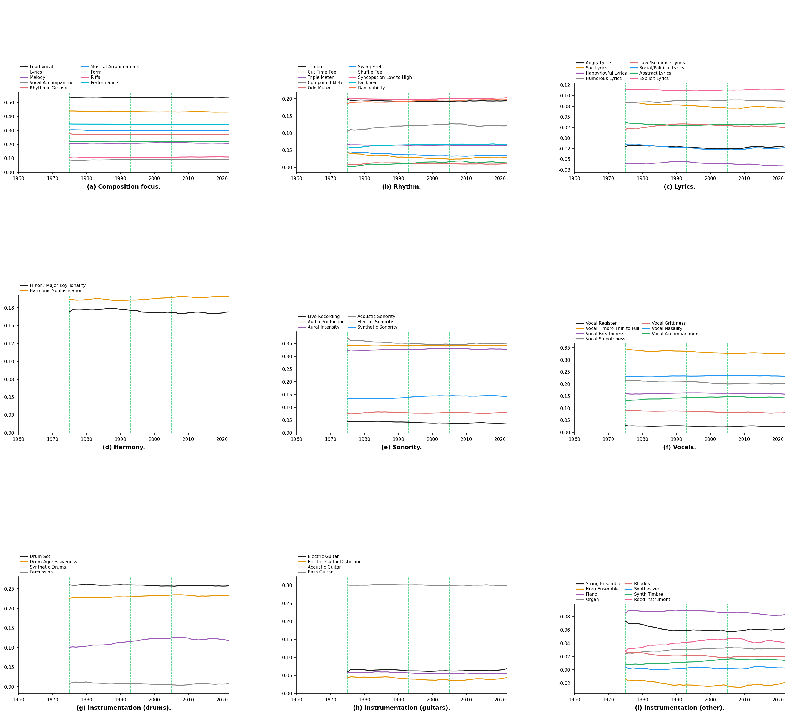

### 0420 REPORT

## 1. DATASETS

The dataset utilized in this study comprises approximately 9,000 Taiwanese popular
music tracks spanning 1975–2021. The track listing was derived fromTaiwan Popular Music 200 Albums (台灣流行音樂 200 輯)(2009), a curated anthology compiled
by music critics and industry practitioners including 陶曉清, 馬世芳, and 葉雲平,
among others. While the selection reflects the editorial perspective of its contributors
and may carry inherent cultural bias, it provides a comprehensive coverage of Taiwanese popular music from 1975 to 2005, encompassing multiple linguistic and ethnic
traditions including Hokkien, Hakka, Indigenous, and Mandarin-language music. For
the period from 2006 to 2021, the track listing was supplemented with albums selected from the 中華音樂人交流協會 Annual Top Ten Albums, a yearly selection
that continues the curatorial approach ofTaiwan Popular Music 200 Albums and
maintains consistency in selection criteria across the full dataset span.
Metadata including lyrics and platform-specific information (e.g., language tags,
genre labels, published companies) were retrieved from Apple Music and KKBOX
where available. For tracks sourced from YouTube, such metadata are unavailable.

## 2. EXPERIMENTS
All audio embeddings were extracted using MERT-v1-330M (m-a-p/MERT-v1-330M),
a self-supervised audio representation model pre-trained on large-scale music corpora.
For each track, a 30-second segment centered at the song’s midpoint was extracted,
downmixed to mono, and resampled to 24 kHz. The final embedding for each track
was obtained by mean-pooling the last hidden state across all time frames, yielding
a 1,024-dimensional vector. This extraction strategy assumes that the central segment is representative of a song’s overall musical character, and fast testing for this method.
Ramoneda et al. (2025) introduced an audio benchmarking framework based on
the MGPHot dataset, which comprises 21,320 tracks from the Billboard Hot 100
(1958–2022) annotated with 58 continuous musicological attributes. They provided
precomputed embeddings extracted using MERT-v1-330M, along with a standardized train/val/test split and model protocol for music feature generation.
annotations.

## 3 RESULTS
The figure presents the mean values of 58 probe-predicted attributes averaged per
year.In the Composition Focus category, all attributes remain stable throughout the
observed period. Lead Vocal consistently achieves the highest score within this category, followed by Lyrics, which also maintains a relatively high value compared to
other attributes.
In the Rhythm category, Syncopation Low to High, Danceability, and Tempo
exhibit the highest scores among all rhythm attributes. Notably, Compound Meter
shows a gradual increase from 1975 until approximately 2005, after which it slowly
declines.
During the analysis, negative probe output values were observed in the Lyrics category, which fall outside the valid range of MGPHot annotations. This was traced to a scale mismatch between the MGPHot reference embeddings (L2 norm ≈ 261) and the current TW embeddings (L2 norm ≈ 5.5). The current implementation extracts embeddings by mean pooling over the final hidden layer of MERT-v1-330M. However, Ramoneda et al. (2025) do not explicitly specify their extraction procedure, and the repository does not include the corresponding extraction script.

## 4. IDENTIFIED ISSUE AND PLANNED CORRECTION
To investigate the scale mismatch, two extraction methods were tested on a sample track. Method A, which extracts only the final hidden layer, yielded an L2 norm of 5.37. Method B, which averages across all 25 hidden layers, yielded 255.42, closely matching the MGPHot reference embeddings (≈261, difference < 2%). 
Based on this finding, all TW embeddings will be re-extracted using Method B, and the probe inference and downstream analyses will be rerun accordingly.

